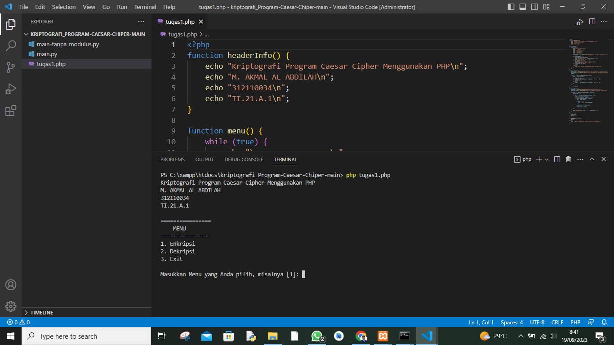
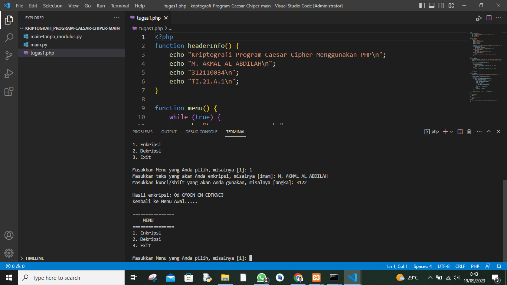
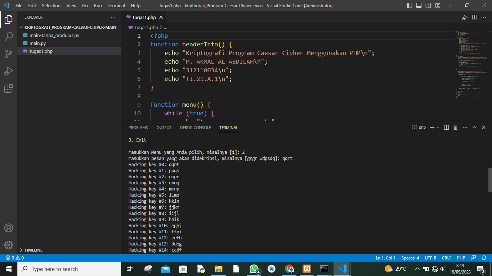
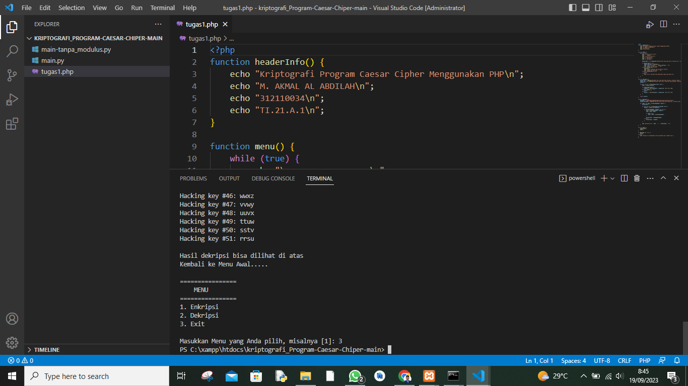

# Kriptografi Pertemuan 1

## Profil
| #               | Biodata                      |
| --------------- | ---------------------------- |
| **Nama**        | M. AKMAL AL ABDILAH          |
| **NIM**         | 312110034                    |
| **Kelas**       | TI.21.A.1                    |
| **Mata Kuliah** | Kriptografi                  |


<p align="center">
 
</p>
<p align="center">
<a href="https://github.com/akmalabdilah"></a>
<p align="center">

<hr>

## Kriptografi Program Caesar Cipher Menggunakan PHP

<hr>

<p>
Disini saya akan menjelaskan secara singkat apa itu Kriptografi Program Caesar Cipher Menggunakan PHP,

Kriptografi Program Caesar Cipher Menggunakan PHP adalah sebuah program yang digunakan untuk melakukan enkripsi dan dekripsi teks menggunakan metode Caesar Cipher. 

Caesar Cipher adalah teknik enkripsi sederhana yang menggeser setiap huruf dalam teks asli sejauh jumlah tertentu dalam abjad. Program ini dibuat dengan menggunakan bahasa pemrograman PHP dan memungkinkan pengguna untuk memasukkan teks, mengatur jumlah pergeseran (kunci), dan kemudian mengenkripsi atau mendekripsi teks sesuai dengan pergeseran yang ditentukan. 

Program ini dibuat oleh Lindo Prasetyo dan mencakup fitur-fitur seperti menu, enkripsi, dekripsi, dan tampilan informasi header. Tujuan utama dari program ini adalah untuk memahami dan mengimplementasikan konsep dasar dalam kriptografi dengan menggunakan metode Caesar Cipher.
</p>

<p>
Oke tanpa basa basi laki ini adalah score code dan gambaran hasilnya.
</p>


```php
function headerInfo() {
    echo "Kriptografi Program Caesar Cipher Menggunakan PHP\n";
    echo "M. AKMAL AL ABDILAH\n";
    echo "312110034\n";
    echo "TI.21.A.1\n";
}

function menu() {
    while (true) {
        echo "\n================\n";
        echo "    MENU\n";
        echo "================\n";
        echo "1. Enkripsi\n";
        echo "2. Dekripsi\n";
        echo "3. Exit\n\n";

        $input_menu = (int)readline("Masukkan Menu yang Anda pilih, misalnya [1]: ");

        if ($input_menu == 1) {
            $hasil_enkripsi = enkripsi();
            echo "\nHasil enkripsi: " . $hasil_enkripsi . "\n";
            echo "Kembali ke Menu Awal.....\n";
        } elseif ($input_menu == 2) {
            dekripsi();
            echo "\nHasil dekripsi bisa dilihat di atas\n";
            echo "Kembali ke Menu Awal.....\n";
        } elseif ($input_menu == 3) {
            break;
        } else {
            echo "Error: pastikan Anda memasukkan angka yang benar!\n";
        }
    }
}

function enkripsi() {
    $input_text = readline("Masukkan teks yang akan Anda enkripsi, misalnya [imam]: ");
    $input_key = (int)readline("Masukkan kunci/shift yang akan Anda gunakan, misalnya [angka]: ");
    $result = "";

    for ($i = 0; $i < strlen($input_text); $i++) {
        $char = $input_text[$i];

        if (ctype_upper($char)) {
            $result .= chr((ord($char) + $input_key - 65) % 26 + 65);
        } elseif ($char == " ") {
            $result .= " ";
        } else {
            $result .= chr((ord($char) + $input_key - 97) % 26 + 97);
        }
    }

    return $result;
}

function dekripsi() {
    $Alphabet = "ABCDEFGHIJKLMNOPQRSTUVWXYZabcdefghijklmnopqrstuvwxyz";
    $input_encrypted = readline("Masukkan pesan yang akan didekripsi, misalnya [grgr wdpsdq]: ");

    for ($key = 0; $key < strlen($Alphabet); $key++) {
        $translated = "";

        for ($i = 0; $i < strlen($input_encrypted); $i++) {
            $symbol = $input_encrypted[$i];

            if (strpos($Alphabet, $symbol) !== false) {
                $num = strpos($Alphabet, $symbol);
                $num = $num - $key;

                if ($num < 0) {
                    $num = $num + strlen($Alphabet);
                }

                $translated .= $Alphabet[$num];
            } else {
                $translated .= $symbol;
            }
        }

        echo "Hacking key #" . $key . ": " . $translated . "\n";
    }
}

function main() {
    headerInfo();
    menu();
}

if (PHP_SAPI === 'cli') {
    main();
} else {
    echo "Program ini dimaksudkan untuk dijalankan dari command line.";
}
?>

```






<p>
Karna di gambar ada program python juga saya hanya menjelaskan php saja sekian selesai.
</p>

<div>
<h2 align="center">Thanks For Reading!!!</h2>
<div align="center">
